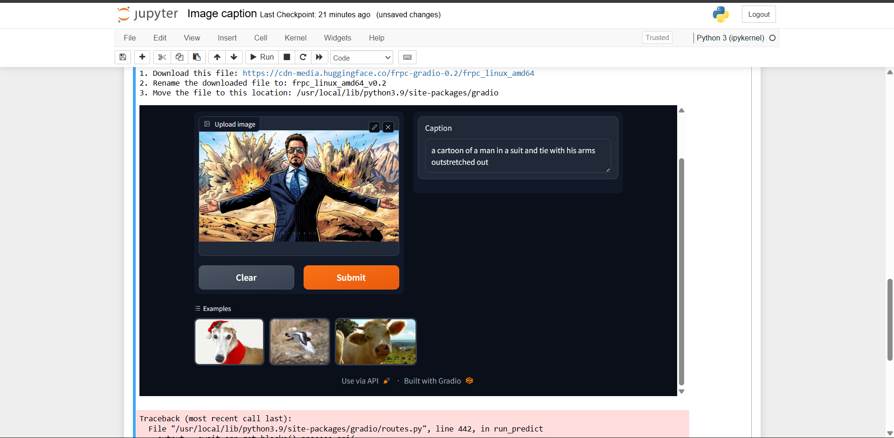

# Prototype Development for Image Captioning Using BLIP Model and Gradio Framework
### AIM:

To design and develop a prototype application for image captioning using the BLIP model and deploy the application through the Gradio framework for generating descriptive captions for uploaded images.

### PROBLEM STATEMENT:

Automatically understanding and describing image content is a challenging task in computer vision and artificial intelligence. Traditional image-processing systems cannot effectively generate meaningful natural language descriptions from visual inputs.

The objective of this experiment is to develop an image captioning prototype using the BLIP model hosted through the HuggingFace Inference API and deploy it using the Gradio framework. The application should accept image inputs from users, process them through the image captioning model, and generate accurate textual descriptions for the uploaded images.

## DESIGN STEPS:
### STEP 1:

Import the required libraries, load the HuggingFace API key from environment variables, and create a helper function to communicate with the HuggingFace image-to-text inference endpoint.

### STEP 2:

Create functions to convert uploaded images into Base64 format and send them to the BLIP image captioning model for generating captions.

### STEP 3:

Develop and launch an interactive Gradio interface that allows users to upload images and receive generated captions from the BLIP model.

### PROGRAM:
```
import os
import io
import IPython.display

from PIL import Image

import base64

from dotenv import load_dotenv, find_dotenv

_ = load_dotenv(find_dotenv())

hf_api_key = os.environ['HF_API_KEY']


# Helper Functions

import requests
import json


# Image-to-Text Endpoint

def get_completion(
    inputs,
    parameters=None,
    ENDPOINT_URL=os.environ['HF_API_ITT_BASE']
):

    headers = {
        "Authorization": f"Bearer {hf_api_key}",
        "Content-Type": "application/json"
    }

    data = {
        "inputs": inputs
    }

    if parameters is not None:
        data.update({"parameters": parameters})

    response = requests.request(
        "POST",
        ENDPOINT_URL,
        headers=headers,
        data=json.dumps(data)
    )

    return json.loads(
        response.content.decode("utf-8")
    )


# Sample Image

image_url = (
    "https://free-images.com/sm/9596/"
    "dog_animal_greyhound_983023.jpg"
)

display(IPython.display.Image(url=image_url))


# Generate Caption

get_completion(image_url)


# Import Gradio

import gradio as gr


# Convert Image to Base64 String

def image_to_base64_str(pil_image):

    byte_arr = io.BytesIO()

    pil_image.save(
        byte_arr,
        format='PNG'
    )

    byte_arr = byte_arr.getvalue()

    return str(
        base64.b64encode(byte_arr).decode('utf-8')
    )


# Image Captioning Function

def captioner(image):

    base64_image = image_to_base64_str(image)

    result = get_completion(base64_image)

    return result[0]['generated_text']


# Close Existing Gradio Instances

gr.close_all()


# Create Gradio Interface

demo = gr.Interface(

    fn=captioner,

    inputs=[
        gr.Image(
            label="Upload image",
            type="pil"
        )
    ],

    outputs=[
        gr.Textbox(label="Caption")
    ],

    title="Image Captioning with BLIP",

    description="""
Caption any image using
the BLIP model
""",

    allow_flagging="never",

    examples=[
        "christmas_dog.jpeg",
        "bird_flight.jpeg",
        "cow.jpeg"
    ]
)


# Launch Application

demo.launch(
    share=True,
    server_port=int(os.environ['PORT1'])
)
```
### OUTPUT:



### RESULT:
Thus, the image captioning prototype was successfully developed using the BLIP model and Gradio framework. The application successfully generated meaningful captions for uploaded images through an interactive web-based interface.